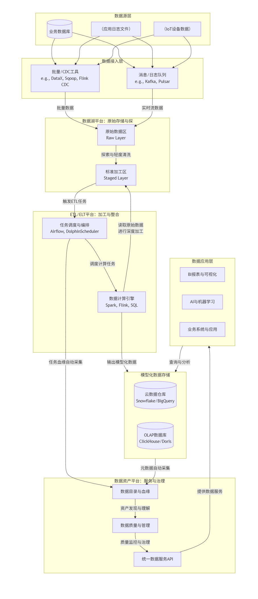

# alinesno-infra-data-assets
提供数据资产管理的功能，用于管理和维护组织的数据资产，包括数据目录、数据词典、数据血缘等。

## 包结构说明

- `alinesno-infra-data-assets-collector`:  数据资产三方数据接收模块，用于接收来自第三方数据源，例如文件、API、保存到数据资产平台中进行管理。
- `alinesno-infra-data-assets-metrics`:  指标管理模块，用于做数据资产接口能力的分析和提供对应的数据指标。
- `alinesno-infra-data-assets-api`: 提供数据资产管理的API接口。
- `alinesno-infra-data-assets-domain`: 提供数据资产管理的领域模型。

## 架构图

 *(注：请将架构图文件放入 `docs/images/` 目录下)*

以下为相关项目地址:

- 数据湖平台: https://gitee.com/alinesno-infrastructure/alinesno-infra-data-lake
- 数据编排计算平台: https://gitee.com/alinesno-infrastructure/alinesno-infra-data-scheduler
- 数据资产平台：https://gitee.com/alinesno-infrastructure/alinesno-infra-data-assets

### 现代数据平台核心架构

现在，我们按照图中箭头的顺序，一步步跟踪数据的旅程：

#### **第1步：数据接入 (Data Ingestion)**

*   **路径**：`数据源层` → `数据接入层` → `数据湖平台 (原始数据区)`
*   **过程**：
    *   来自业务数据库（如MySQL）、应用程序日志、IoT设备等各种数据源的数据，通过**批量工具**（如DataX, Sqoop）或**实时流**（如Kafka）被采集。
    *   所有这些数据以**原始格式**（不做任何修改）被注入到数据湖的 **“原始数据区”（Raw Layer）**。这里是数据的“原始仓库”。

#### **第2步：数据探索与轻度标准化 (Exploration & Staging)**

*   **路径**：`数据湖平台 (原始数据区)` → `数据湖平台 (标准加工区)`
*   **过程**：
    *   数据工程师或科学家会对原始数据进行探索、摸底和 profiling。
    *   通常会进行一些最基础的清洗（如格式标准化、无效字符处理），然后放入 **“标准加工区”（Staged Layer）**。这里的数据仍然是细粒度的，但更规整一些，为后续的深度加工做准备。

#### **第3步：ETL/ELT加工 (Processing)**

*   **路径**：`数据湖平台 (标准加工区)` → `ETL/ELT平台` → `模型化数据存储`
*   **过程**：
    1.  **ETL平台的任务调度器（如Airflow）** 被触发，它按照预设的工作流（DAG）开始执行。
    2.  调度器启动**计算引擎（如Spark）**。
    3.  计算引擎从数据湖的“标准加工区”读取数据。
    4.  执行复杂的业务逻辑：**数据清洗、关联、聚合、维度建模**等（例如，将用户信息、订单记录、商品数据整合成一张“每日销售事实宽表”）。
    5.  加工后的、模型化的高质量数据被输出到专门的**模型化数据存储**中，如云数据仓库（Snowflake）或OLAP数据库（ClickHouse），以供高性能查询。

#### **第4步：资产化与治理 (Governance)**

*   **路径**：`模型化数据存储` & `ETL/ELT平台` → `数据资产平台`
*   **过程**：
    *   **数据资产平台**会自动从**模型化数据存储**和**ETL调度平台**采集**元数据**。
    *   这些元数据在资产平台中形成：
        *   **数据目录**：用户可像在图书馆查书一样搜索数据。
        *   **数据血缘**：清晰展示一张表是从哪些源表，经过哪些任务加工而来。
        *   **质量监控**：定义和监控数据质量规则。
    *   数据从此不再是冰冷的表，而是变成了可查找、可理解、可信任的 **“数据资产”**。

#### **第5步：服务化与消费 (Consumption)**

*   **路径**：`数据资产平台` → `数据应用层`
*   **过程**：
    *   资产平台通过**统一数据服务API**或数据市场，将数据安全地暴露给下游应用。
    *   **BI工具**（如Tableau）直接连接到底层的模型化数据存储，制作报表。
    *   **AI平台**通过API获取特征数据用于模型训练。
    *   **业务应用**直接调用数据服务获取所需信息。

## 功能列表

1. **仪表板 (Dashboard):**
    - 提供一个总览界面，用于展示关键指标和重要信息概览。

2. **资产管理 (Asset Management):**
    - 资产管理：用于管理各种数据资产，包括查看和维护数据集的信息。
    - 分类管理：对数据进行分类，以便更好地组织和检索。
    - 安全管理：确保数据的安全性，包括访问控制、加密和其他安全措施。

3. **数据服务 (Data Service):**
    - 接口目录: 提供接口目录，用于管理数据接口，包括接口定义、文档和测试。
    - API开发: 提供API开发工具，用于生成和测试数据接口。
    - 客户端: 提供客户端工具，用于访问数据接口。

4. **数据运营 (Data Operations):**
    - 计量统计：收集和分析数据使用情况以评估性能和效率。
    - 满意度评价：收集用户反馈以改进数据质量和服务。
    - 审批管理：管理数据访问请求和变更申请的过程。

5. **生命周期管理 (Lifecycle Management):**
   - 数据生命：管理数据在其生命周期内的不同阶段的状态变化。
   - 周期配置：定义数据生命周期的规则和流程。

6. **系统管理 (System Management):**
    - 权限管理：控制用户对系统的访问级别和操作权限。
    - 备份与恢复：确保数据的可靠性和可恢复性。
    - 使用分析：监控系统使用情况，帮助优化性能和用户体验。

## 库设计

- 元数据库: mysql
- 数据资产库: postgresql

- (不在当前应用管理中)数据仓库: clickhouse + minio(分布式存储)

## 自定义api接口模板

```groovy
import groovy.transform.Canonical
import org.springframework.jdbc.core.JdbcTemplate
import org.springframework.jdbc.core.RowMapper

// 定义数据操作的sql
def querySql = "SELECT id, name, created_date FROM my_table WHERE created_date > ?"

// 创建RowMapper实例，用于将数据库行转换为MyDto对象
RowMapper<MyDto> rowMapper = { resultSet, rowNum ->
    def dto = new MyDto(
            resultSet.getInt("id"),
            resultSet.getString("name"),
            resultSet.getDate("created_date")
    )
    // 在 RowMapper 中进行 DTO 校验
    dto.validate()
    return dto
}

// 假设 jdbcTemplate 已经被正确配置并注入到当前上下文中
def jdbcTemplate = new JdbcTemplate(/* 数据源配置 */)

// 设置查询参数
def oneMonthAgo = new Date() - 30 // 假设我们想获取最近一个月的数据

// 参数校验
if (oneMonthAgo == null) {
    throw new IllegalArgumentException("查询参数不能为null")
}

// 执行查询
def output = jdbcTemplate.query(querySql, [oneMonthAgo] as Object[], rowMapper)

// 返回查询结果
return output

// 使用 @Canonical 注解简化 DTO 类的定义
@Canonical
class MyDto {
    int id
    String name
    Date createdDate

    // DTO 校验方法
    void validate() {
        if (id <= 0) {
            throw new IllegalArgumentException("ID 必须大于 0")
        }
        if (!name || name.trim().isEmpty()) {
            throw new IllegalArgumentException("名称不能为空")
        }
        if (createdDate == null) {
            throw new IllegalArgumentException("创建日期不能为空")
        }
    }
}
```


## 鸣谢

- 开发参考阿里云的数据资产运营平台：https://www.aliyun.com/product/data-asset-platform